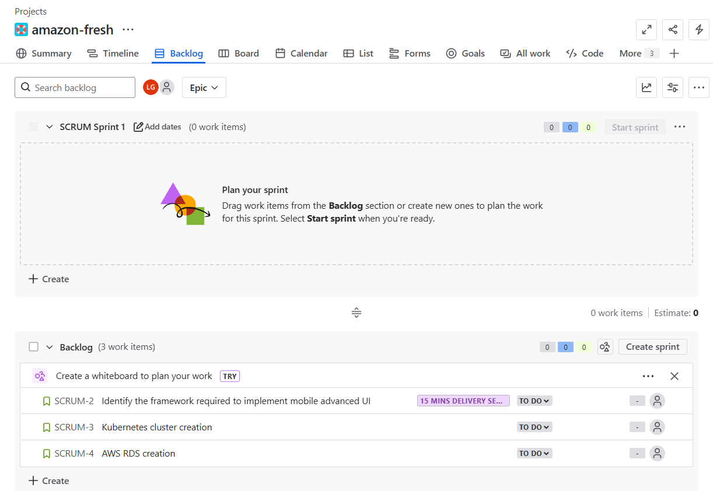

# 🛠️ Agile Project Management with Jira (Scrum Demo)

This project demonstrates my hands-on experience with **Jira** using the **Scrum** framework. It simulates managing a small technical project using Agile best practices.

---

## 📌 Key Highlights

- Set up a **Jira Scrum workspace** from scratch
- Created a main **Epic** and organized related **User Stories**
- Used **Scrum board and backlog** views for sprint planning
- Assigned tasks and managed workflow through Jira’s UI
- Applied Agile ceremonies: Sprint Planning, Standups, Sprint Review

---

## 🧪 Example Use Case

**Project:** *Amazon Fresh Infra Setup*  
**Epic:** Setup infrastructure for Amazon Fresh  
**User Stories:**

- `SCRUM-2` – Identify the framework required to implement mobile advancement
- `SCRUM-3` – Kubernetes cluster creation
- `SCRUM-4` – AWS RDS creation

All stories are currently in **To Do** status and ready for sprint planning.

---

## 📸 Jira Board

---

## 🧰 Tools Used

- **Jira** – For project management and issue tracking
- **Scrum Framework** – For agile project structure

---

## 📂 Repo Purpose

This repository is meant to:

- Display Agile project management skills
- Show experience using Jira in real workflows
- Help potential employers or collaborators evaluate practical knowledge of Scrum methodology

